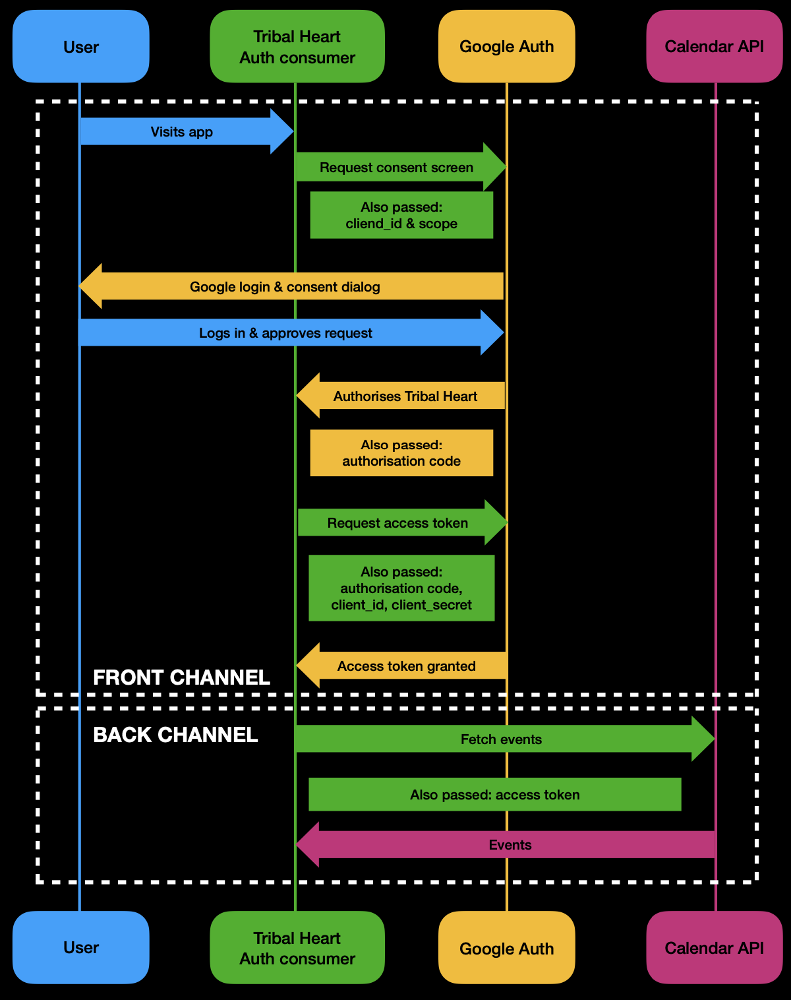

# Tribal Heart

Tribal Heart is serverless, meet-up-like PWA written with React. The application makes contact with the Google Calendar API to fetch upcoming events.

  

Its features as as follows.

## Feature 1 of 6: Filter Events by City

> As a user, I want to filter events by city, so that I can see the list of events that take place in that city.

Scenario: Filter events by selected city

- Given the user is on the events page;
- When the user selects a city from the filter options;
- Then a list of events for the selected city is displayed.

Scenario: List suggestions when a city is being searched for

- Given the main page is open;
- When user starts typing into the city textbox;
- Then a list of cities (suggestions) that match what they’ve already typed is displayed.

Scenario: Select a city from the suggested list.

- Given user has typed "Ber" in the city textbox AND the list of suggested cities is showing;
- When the user clicks on a city (eg. "Berlin, Germany") from the list;
- Then the user receives a list of upcoming events in that city.

Scenario: City with no events

- Given the user is on the events page and some cities have zero events but are somehow listed;
- When the user selects that city that has zero events;
- Then the app displays some sort of feedback that the city filter has been applied but there are no events in that city.

## Feature 2 of 6: Show/Hide Event Details

> As a user, I want to show/hide event details, so that I can see more/less information about an event

Scenario: Show event details

- Given the user is viewing the list of events;
- When the user clicks on an event to view details where details are not shown;
- Then the event's details are displayed.

Scenario: Hide event details

- Given the user is viewing the list of events;
- When the user clicks on an event where details are already shown;
- Then the event's details are hidden.

Scenario: API failure

- Given the user is viewing the list of events AND there is an error in the backend;
- When the user click on an event to view details;
- Then an appropriate error message is displayed.

## Feature 3 of 6: Specify Number of Events

> As a user, I want to specify the number of events I want to view, so that I can see more or fewer events in the list at once

Scenario: Change the number of events displayed

- Given the user is on the events page;
- When the user sets the number of events to display to a specified number;
- Then exactly that number of events is displayed.

Scenario: 0  number of events displayed

- Given the user is on the events page and for some reason want 0 events displayed;
- When the user set the number of events to 0;
- Then an appropriate message is displayed: "There's nothing here!"

## Feature 4 of 6: Use the App When Offline

> As a user, I want to use the app when offline, so that I can see the events I viewed the last time I was online

Scenario: View previously viewed events offline

- Given the user has previously viewed events while online and I am now offline;
- When the user opens the app;
- Then the list of previously viewed events is displayed.

## Feature 5 of 6: Add an App Shortcut to the Home Screen

> As a user, I want to add the app shortcut to my home screen, so that I can open the app faster

Scenario: Add app shortcut to home screen

- Given the user is on the app page;
- When the user selects the option to add a shortcut to their home screen;
- Then the app shortcut is added to their home screen.

## Feature 6 of 6: Display Charts Visualising Event Details

> As a user, I want to see a chart showing the upcoming events in each city, so that I know what events are organized in which city

Scenario: View event details in a chart format

- Given the user is on the events page;
- When the user selects the option to view events in chart format;
- Then a chart showing the upcoming events in each city is displayed.